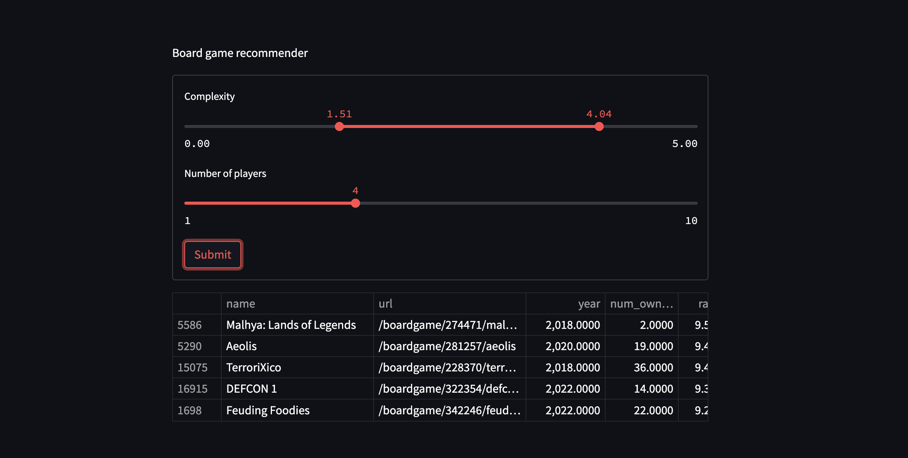

## **MVP**

### Board Game Recommender
### Ryan Solava

For this project, I am building a web app that filters and recommends board games. The pipeline for the project has not significantly changed from the proposal. And progress has been made on essentially all parts of the pipeline. I have set up the data ingestion and done some simple pre-processing, and the data has been stored in an SQL database. A simple Streamlit app can be found [https://share.streamlit.io/rsolava/game_recs/main](here). At this point, the user can filter based on two criteria (player count and complexity) and the top games meeting that criteria are shown. A screenshot of the app is below.

The primary focus is to improve the functionality of the web application. Adding more features to filter by, as well as allowing users to search for games that are similar to selected games. Ideally, I will incorporate NLP methods to compare game descriptions. Additionally, I plan to automate the data ingestion and pre-processing steps, so that new games can be added automatically on a consistent schedule.
